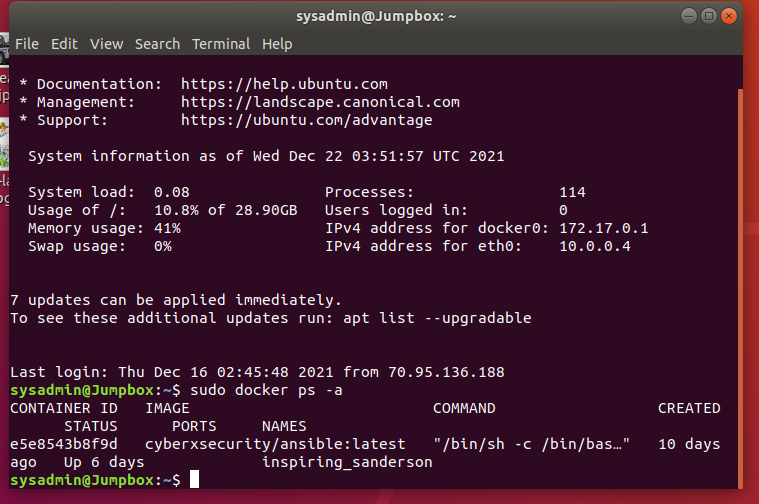

## Automated ELK Stack Deployment

The files in this repository were used to configure the network depicted below.

These files have been tested and used to generate a live ELK deployment on Azure. They can be used to either recreate the entire deployment pictured above. Alternatively, select portions of the file may be used to install only certain pieces of it, such as Filebeat.

https://github.com/Junbaee/Elk-Stack/blob/77f5aeada0c1d57a780a504167d370086e1a2cd9/Files/my-playbook.yml

This document contains the following details:
- Description of the Topology
- Access Policies
- ELK Configuration
  - Beats in Use
  - Machines Being Monitored
- How to Use the Ansible Build

### Description of the Topology

The main purpose of this network is to expose a load-balanced and monitored instance of DVWA, the D*mn Vulnerable Web Application.

Load balancing ensures that the application will be highly Available, in addition to restricting Access to the network.
What aspect of security do load balancers protect? What is the advantage of a jump box?_
It is an additional layer of defense in depth, it is another layer of security that an outsider will have to go through to reach important files or information.
Integrating an ELK server allows users to easily monitor the vulnerable VMs for changes to the files and system services.
What does Filebeat watch for?

It logs files and collect events that happen within those logs and forwards them to another application for indexing/inspecting
What does Metricbeat record?
It collects metrics from the system and services running on the server it is monitoring.
### Access Policies

The machines on the internal network are not exposed to the public Internet. 

Only the Elk-Server machine can accept connections from the Internet. Access to this machine is only allowed from the following IP addresses:
70.95.136.188

Machines within the network can only be accessed by My personal machine.
Which machine did you allow to access your ELK VM? What was its IP address?
My personal machine, the IP Address of my machine is 70.95.136.188
A summary of the access policies in place can be found in the table below.

| Name       | Function | IP Address | Operating System |
|------------|----------|------------|------------------|
| Jumpbox    | Gateway  | 10.0.0.4   | Linux            |
| Web-1      | VM       | 10.0.0.5   | Linux            |
| Web-2      | VM       | 10.0.0.6   | Linux            |
| Elk-Server | Server   | 10.1.0.4   | Linux            |

### Elk Configuration

Ansible was used to automate configuration of the ELK machine. No configuration was performed manually.
What is the main advantage of automating configuration with Ansible?
If you have thousands of VM's on a single network, it is very advantageous to use ansible as it will automate updating all machines at the same time. If this was done by hand, it would take ages to update a thousand VM's with one person working on it.

The playbook implements the following tasks:
- ...SSH into your jumpbox, install docker using the appropriate commands
- ...Download a container image, run the container to create the container and then start and attach to the container.
- ...from the container, you can create a custom ansible playbook in the /etc/ansible path and configure it to your needs using YAML language(.yml)
- ...Run the playbook and it will setup monitoring to your other VM's, connect to your ELK server and double check all other VM's are inter-connected.
- ...Access Kibana through the ELK server public IP Address and correct port.

The following screenshot displays the result of running `docker ps` after successfully configuring the ELK instance.

### Target Machines & Beats
This ELK server is configured to monitor the following machines:
10.0.0.4 - Jumpbox Machine
10.0.0.5 - Web-1 Machine
10.0.0.6 - Web-2 Machine
We have installed the following Beats on these machines:
MetricBeat
FileBeat
These Beats allow us to collect the following information from each machine:
  Filebeat is collecting var/log/syslog files that have been altered and indexing them towards logstash and showing on Kibana to alert you of any changes that you have not made.
Meanwhile, Metricbeat is collecting any logs of system services that are being interacted or altered with, this shows up with Docker as this is a system service and will show logs of containers being ran and attached to.
### Using the Playbook
In order to use the playbook, you will need to have an Ansible control node already configured. Assuming you have such a control node provisioned: 
 SSH into the control node and follow the steps below:
- Copy the Ansible Playbook.yml file to /etc/ansible.
- Update the config.yml file to include "Host" Ip Addresses and have correct Username/Password information.
- Run the playbook, and navigate to /etc/ansible on your machines that your playbook ran on to install services, check that the installation worked as expected.

Which file is the playbook?
Where do you copy it?
  The file that is named *-Playbook.yml is the playbook, you copy it to the /etc/ansible directory.
  The "hosts" in the *-config.yml file needs to be updated to the correct IP Addresses of your specific machine. Each *-playbook.yml file can be edited to specify what the playbook does. Meaning that you may create a seperate Filebeat/Metricbeat playbook that only runs on a specified IP Address(In this case the ELK-Server)
[your public ip address of the ELK server:5601(Because that is the port we specified for it to be open on in our azure security group rules)/app/kibana

cd /etc/ansible
~/etc/ansible ansible-playbook my-playbook.yml( This will run the playbook and intialize the tasks within the playbook, based on the "host" IP addresses that are listed in the "Hosts" file in ~/etc/ansible.

